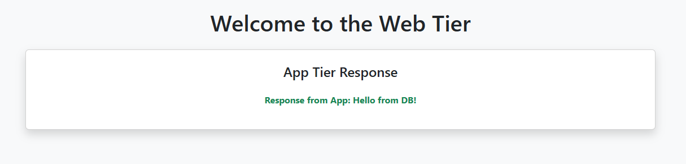

# AWS 3-Tier Architecture Deployment

## 🧭 Overview

This guide walks through deploying a complete **3-tier architecture** on AWS:

- ✅ Custom VPC
- ✅ Public, App, and DB Subnets (2 AZs)
- ✅ Internet & NAT Gateways
- ✅ Route Tables & Security Groups
- ✅ IAM Role for EC2 SSM
- ✅ Launch Templates for Web & App Tiers
- ✅ Auto Scaling Groups (ASG)
- ✅ Application Load Balancer (ALB)
- ✅ RDS MySQL (DB Tier)

<p align="center">
  
</p>

---

## 📌 Step-by-Step Instructions

### 🏗️ Step 1: Create VPC and Subnets

#### 1. VPC
- Go to **VPC → Your VPCs → Create VPC**
- Name: `3Tier-VPC`
- CIDR: `10.0.0.0/16`

#### 2. Subnets (6 total)
- **Public-AZ1** → `10.0.1.0/24`
- **Public-AZ2** → `10.0.2.0/24`
- **App-AZ1** → `10.0.3.0/24`
- **App-AZ2** → `10.0.4.0/24`
- **DB-AZ1** → `10.0.5.0/24`
- **DB-AZ2** → `10.0.6.0/24`

---

### 🌐 Step 2: Set Up Internet & NAT Gateways

#### 1. Internet Gateway
- Name: `3Tier-IGW`
- Attach to `3Tier-VPC`

#### 2. NAT Gateways
- Allocate 2 Elastic IPs
- Create 2 NAT Gateways:
  - AZ1 → NAT-AZ1 (attach to Public-AZ1, use EIP1)
  - AZ2 → NAT-AZ2 (attach to Public-AZ2, use EIP2)

---

### 🛣️ Step 3: Route Tables

#### 1. Public Route Table
- Name: `Public-RT`
- Route: `0.0.0.0/0` → Internet Gateway
- Associate: Public-AZ1, Public-AZ2

#### 2. Private Route Tables
- `Private-RT-AZ1`: `0.0.0.0/0` → NAT-AZ1 → App-AZ1
- `Private-RT-AZ2`: `0.0.0.0/0` → NAT-AZ2 → App-AZ2

---

### 🔐 Step 4: Security Groups

#### 1. WebSG
- Inbound: HTTP(80) from `0.0.0.0/0`, SSH(22) from My IP
- Outbound: All

#### 2. AppSG
- Inbound: TCP(4000) from WebSG
- Outbound: All

#### 3. DBSG
- Inbound: MySQL(3306) from AppSG
- Outbound: All

---

### 🧑‍💼 Step 5: IAM Role for EC2 SSM

- Go to **IAM → Roles → Create Role**
- Use Case: EC2
- Attach: `AmazonSSMManagedInstanceCore`
- Name: `EC2-SSM-Role`

---

### 🧱 Step 6: Launch Templates

#### 1. Web Tier
- Go to **EC2 → Launch Templates → Create Launch Template**
- Name: `WebTemplate`
- AMI: Amazon Linux 2
- Type: `t2.micro`
- Key Pair: Optional
- Network:
  - No subnet (ASG handles it)
  - SG: `WebSG`
  - Auto-assign Public IP: Enabled
- IAM Role: `EC2-SSM-Role`
- User Data: `launch-scripts/web-user-data.sh` (Replace Your-ALB-Name with your actual Application Load Balancer DNS) 

#### 2. App Tier
- Name: `AppTemplate`
- AMI: Amazon Linux 2
- Type: `t2.micro`
- Key Pair: Optional
- Network:
  - No subnet (ASG handles it)
  - SG: `AppSG`
- IAM Role: `EC2-SSM-Role`
- User Data: `launch-scripts/app-user-data.sh` (Replace Your-RDS-Parameters with your actual values)

---

### 🎯 Step 7: Create Target Groups

#### TG-Web-Tier
- Port: 80  
- Protocol: HTTP  
- VPC: `3Tier-VPC`  
- Health Check Path: `/`

#### TG-App-Tier
- Port: 4000  
- Protocol: HTTP  
- VPC: `3Tier-VPC`  
- Health Check Path: `/api/*`

---

### 🌐 Step 8: Create Application Load Balancer

- Go to **EC2 → Load Balancers → Create Load Balancer**
- Type: `Application`
- Name: `ALB-Web`
- Scheme: Internet-facing
- Subnets: Public-AZ1, Public-AZ2
- SG: `WebSG`
- Listener:
  - HTTP:80 → Forward to `TG-Web-Tier`
- Skip registering targets

---

### ➕ Step 9: Add Listener Rule to ALB

- Go to **EC2 → Load Balancers → ALB-Web → Listeners → HTTP:80 → View/Edit Rules**
- Add Rule:
  - IF Path is `/api/*` → Forward to `TG-App-Tier`
  - Priority: `1`

---

### ⚙️ Step 10: Auto Scaling Groups (ASG)

#### Web Tier ASG
- Name: `ASG-Web-Tier`
- Template: `WebTemplate`
- Subnets: Public-AZ1, Public-AZ2
- Attach to ALB: `TG-Web-Tier`
- Desired: 2 | Min: 1 | Max: 2

#### App Tier ASG
- Name: `ASG-App-Tier`
- Template: `AppTemplate`
- Subnets: App-AZ1, App-AZ2
- No Load Balancer
- Desired: 2 | Min: 1 | Max: 3

---

### 🛢️ Step 11: Create DB Subnet Group

- Go to **RDS → Subnet Groups → Create**
- Name: `db-subnet-group`
- VPC: `3Tier-VPC`
- Add Subnets:
  - DB-AZ1: `10.0.5.0/24`
  - DB-AZ2: `10.0.6.0/24`

---

### 🧩 Step 12: Setup RDS (MySQL)

- Go to **RDS → Create Database**
- Engine: MySQL (Free Tier)
- DB Instance ID: `db-3tier`
- Username: `admin`
- Password: your password
- Class: `db.t3.micro`
- Public Access: No
- Subnet Group: `db-subnet-group`
- SG: `DBSG`

---

### 🧪 Step 13: DB Table Initialization

#### 🛠️ Manually Create Database and Table

1. SSH into your **App Tier EC2 instance** using **Session Manager**.

2. Run the MySQL client command to connect to the RDS instance:

   ```bash
   mysql -h <your_rds_endpoint> -u <username> -p

🔑 Enter your RDS password when prompted.

Inside the MySQL shell, run the following SQL commands:

- CREATE DATABASE YourDBName;
  
- USE YourDBName;

- CREATE TABLE messages (
  id INT AUTO_INCREMENT PRIMARY KEY,
  content VARCHAR(255)
);

-INSERT INTO messages (content) VALUES ('Hello from DB!');

---

### ✅ Final Output

When you access the **Web ALB DNS**, it renders a **PHP page** calling the **App Tier** on `/api/test`, which in turn fetches data from **RDS** and returns:  
**`Hello from DB!`**

